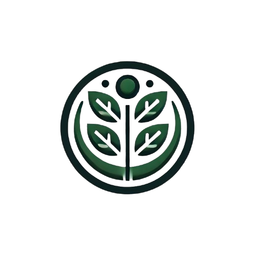

# <p align="center">SeedMap - Crop Management Tool</p>

<p align="center"></p>
<p align="center">A crop management tools to allow farmers to manage their crops, journal about their farming, and rotate crops.</p>

## 👥 Team

| Name                | Role                              |
| ------------------- | --------------------------------- |
| **Cooper Dickson**  | Data Scientist                    |
| **Aiden Foster**    | Frontend Developer                |
| **Alex Groom**      | Backend Developer, Database Admin |
| **Matthew Collett** | Backend Developer                 |

## 🚀 Local Run

### Prerequisites

- **Node.js** and **Yarn** must be installed on your machine. You can verify if you have these by running the following commands

```bash
node -v
yarn -v
nvm -v  # For Windows, use 'nvm version'
```

#### Windows

- You can download Node.js from the official [Node.js website](https://nodejs.org/en)
- After installing Node.js, install Node Version Manager (`nvm`) by following [this guide](https://www.freecodecamp.org/news/node-version-manager-nvm-install-guide/)
- After installing Node.js, install Yarn by running

```bash
npm install -g yarn
```

#### macOS

- On macOS, you can install Node.js via Homebrew

```bash
brew install node
```

- To install Node Version Manager (`nvm`), also use Homebrew

```bash
brew install nvm
```

**Note**: I had some issues with nvm not being added to my path, so if after installing you still cannot run `nvm -v`, add it to your path and try again

```bash
export NVM_DIR="$HOME/.nvm"
[ -s "/opt/homebrew/opt/nvm/nvm.sh" ] && \. "/opt/homebrew/opt/nvm/nvm.sh"
```

- To install Yarn, also use Homebrew

```bash
brew install yarn
```

- If you do not have Homebrew on your mac, I would highly recommend installing it [here](https://brew.sh/).

### Steps

1. First, start by cloning this repository to your local machine

```bash
git clone https://github.com/swe4103/aecq-2024.git
```

2. Navigate into the project directory

```bash
cd aecq-2024
```

3. Install and use the version of node specified in the `.nvmrc` file by running the following commands

```bash
nvm install
nvm use
```

4. Install the necessary dependencies

```bash
yarn install
```

5. At this point, you can run either just the client (frontend React.js application), just the server (backend Express.js API), or you can run them concurrently, communicating with eachother

**Client**

```bash
yarn run client
```

Client application should be running at `http://localhost:5173`

**Server (API)**

```bash
yarn run api
```

API server application should be running at `http://localhost:3000`

**Both**

```bash
yarn run dev
```

This will run both the client and the API server concurrently communicating with eachother in the foreground.
